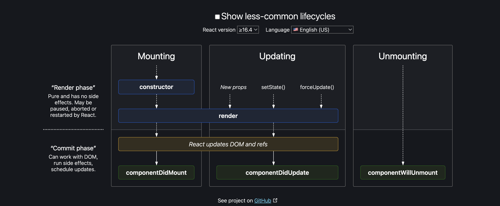

# Class 2 - Inginiting our App

🚀 Notes:

- package.json is a configuration of our npm.
- npm take care all the depecendency and its version

🚀 Note:

- Before going to production out codes needs to be clean and short, thats why we make those code as bundlers
- bundlers make those code as a package to send those in production
- parcel will ignite of our app
- npm init (I have to add name, license, version etc)
- npm init -y (it make all this thing yes)
- npm install -D parcel (D is used for developer)

🚀 Notes:

- "devDependencies": {
  "parcel": "^2.12.0"
  } we use "^" (caret) for minor changes update, npm will automatically install this minor changes
- Use ^ (caret) when you want to allow more flexibility with minor version updates.
- Use ~ (tilde) when you want to restrict updates to patch versions only.
  "devDependencies": {
  "example-package": "^1.2.3", // Allows 1.2.x and 1.x.x, but not 2.x.x
  "another-package": "~1.2.3" // Allows 1.2.x, but not 1.3.x
  }

🚀 Notes:

- package-lock.json file track all the version of the dependency
- When I install parcel in node_modules there is lot of file also, because parcel have lot of dependency and their dependency has lot. so that all the dependency file exist in node_modules

* This is known as Transitive dependency \*
  Node_modules is pack of all dependency

- ⭐️ npx parcel index.html ⭐️
- npm i react react-dom
- add 'main':'index.js'

# Parcel

- Dev build
- Local Server
- HMR (Hot module replacement) If code change and saved browser automatically refresh
- Parcel is using a file watching algorithm using C++
- Caching - faster build
- Image optimization
- Minification
- Bundling
- Compressing
- Consistent hashing
- Code spliting
- Differential bundling(parcel take care for all browser as well as older browser)
- Error handling(Better way to display error in console)
- give support for HTTPs support
- Tree shaking (remove unnecessary code)

🚀 Parcel production build notes:

- remove the "main": "App.js", from package.json as for this build we directly provide the entry point file
- ⭐️ npx parcel build index.html ⭐️

🚀 Notes:

- We can use 'browserlists' to add the in whicn browser version our website will be supported

# Class-3 Laying the foundation

🚀 Notes:

- add a 'start':'parcel index.html' to start our project using ⭐️ npm start or npm run start ⭐️
- ⭐️ npm run build ⭐️ as build add in the package.json script file

🚀 JSX

- JSX is part of react not exactly react, react code also use using normal js file
- JSX is different than html
- in js file if we write-> let jsxHeading = <h1>Hello from JSX</h1>
- This not exacly html code, its a jsx code, we can say html like syntax
- JSX is not a pure javascript code
- Babel is convert jsx code to react code(compile or we can say transpile)

🚀 React components

1. Functional component

- A function returns a JSX code or we can say react element or bunch of react elements is called Functional component.

2. Class based component

- Component composition(component inside another component)

🚀 Notes:
JSX (transpiled by Babel) ⇒ React.createElement ⇒ ReactElement
⇒ JS Object ⇒ HTML Element(render)

# Class-4 Talk less make project

## 🚀 React Keys: Best Practices

In React, the `key` prop is essential for optimizing the rendering of lists. It helps React identify which items have changed, are added, or are removed, leading to improved performance and better state management.

## Why Use `key` in React?

1. **Performance Optimization**:

   - React uses keys to determine which elements have changed, allowing it to minimize re-renders. This results in a more efficient update process for lists.

2. **Maintaining Component State**:

   - Keys help React track the state of individual components. For example, in a list of input fields, using keys ensures that the state of each input is preserved even if the list is reordered.

3. **Avoiding Unnecessary Re-renders**:
   - By providing unique keys, React can skip re-rendering components that haven't changed, enhancing application performance.

## Why It's Bad Practice to Use Index as Key

1. **Stability Issues**:

   - If the list is modified (e.g., items are reordered or removed), using the index can lead to incorrect behavior. React may misidentify components, causing bugs.

2. **State Loss**:

   - Components that rely on their indices for keys may lose or incorrectly assign state when the list order changes. For example, moving an input field can result in it displaying the wrong value.

3. **Performance Issues**:
   - Using indices can lead to unnecessary re-renders, as React may not recognize that the actual data has changed, only the indices.

## Best Practices

- Always use a stable and unique identifier (like a database ID) as a key when rendering lists in React.
- Avoid using indices as keys to ensure correct behavior, state management, and optimal performance.

## Conclusion

Using keys properly is crucial for building efficient and reliable React applications. Following best practices regarding keys will help you maintain component state and improve overall performance.

# Episode-05 | Let's Get Hooked

🚀 Default export/import

- export default Component
- ✨ import Component from 'path'

🚀 Named export/import

- export const name = 'ranajit'
- export const sum = ()=> {return 1+2}
- ✨ import {name,sum} from 'path'

React fiber, react reconcialiation, react diffing

https://github.com/acdlite/react-fiber-architecture

# Episode-06 | Exploring the World

condition rendering (Rendering with some condition)
shimmer UI(fake skeleton of UI)

🚀 Whenever state variables update, react triggers a reconciliation cycle(re-renders the component)

🚀 Use corsproxy.io for cors issue

# Episode-07 | Finding the Path

There is 2 types routing in web apps

1.  client side routing
2.  server side routing (network call and page refresh happen )

# Episode-08 | Let's Get Classy

- class component

```javascript
import React from "react";
// 🚀 we can directly use Component after destructure from react
// import {Component} from "react";
// class About extends Component {
// render(){
//    return (<></>)
// }

class UserClass extends React.Component {
  constructor(props) {
    super(props);
  }
  render() {
    const { name, place } = this.props; // We can destructure props like this
    return (
      <>
        <h1>Class component</h1>
        <h2>
          This name {name} and place {place} getting from props
        </h2>
      </>
    );
  }
}

export default UserClass;
```

✨ Loading actually means mouting the component in React

### 🚀 Mounting

1. constructor()
2. static getDerivedStateFromProps()
3. render()
4. componentDidMount() // Used for api calls

🚀 React Lifecyle


🚀 ComponentDidUpdate()- This method is called after every update of the component. It is used to update the state of the component.

------- Mounting ------

1. constructor()
2. render()
3. componentDidMount() // API calls
4. this.state changes

------- Update ------

1. render() with new state value
2. componentDidUpdate()

🚀 ComponentWillUnmount()- This method is called when the component is about to be removed from the DOM. It is used to remove the component.

- It is used to cleanup the interval, timeout, event listeners etc.
- Example-

```javascript
import { Component } from "react";
class UserClassApi extends Component {
  async componentDidMount() {
    this.timer = setInterval(() => {
      console.log("Print after 1 sec");
    }, 1000);
  }
  componentWillUnmount() {
    clearInterval(this.timer);
  }
  render() {}
}
export default UserClassApi;
```

### For functional component

```javascript
import React, { useEffect, useRef } from "react";

const UserFunctionApi = () => {
  const timerRef = useRef(null);

  useEffect(() => {
    timerRef.current = setInterval(() => {
      console.log("Print after 1 sec");
    }, 1000);

    // Cleanup function to clear the timer like componentWillUnmount
    return () => {
      clearInterval(timerRef.current);
    };
  }, []);

  return <></>;
};
export default UserFunctionApi;
```

# Episode -09 | Optimizing our App

🚀 Custom Hooks

- Hooks are the utility functions
- Custom hooks are the reusable functions
- They are used to reuse the code for optimization
- More readable, maintainble and testable
- Example-

```javascript
import { useEffect, useState } from "react";

const useRestaurantMenu = (resId) => {
  const [resInfo, setResInfo] = useState([]);

  useEffect(() => {
    fetchData();
  }, []);
  async function fetchData() {
    const response = await fetch(
      `https://api.example.com/restaurant/${resId}/menu`
    );
    const menus = await response.json();
    setResInfo(menus.data);
  }
  return resInfo;
};
export default useRestaurantMenu;
```

## 🚀 Lazy loading

- Lazy loading is a technique to load the components on demand.
- It break our codes in chunks for better performance optimization.
- It is used to optimize the performance of the app.
- ⭐️ Also we called it as Chunking, Code spliting, Dynamic bundling, on demand loading ⭐️

```javascript
import React, { lazy, Suspense } from "react";

const GroceryComponent = lazy(()=>import("./path/Grocery.jsx"));
<Suspense fallback={<h1>Loading....</h1>}> //We can add component insted of html tag
  <GroceryComponent>
</Suspense>
```

# Episode-10 | Jo Dikhta Hai, Vo Bikta Hai

- Material UI
- Ant design
- Bootstrap
- Chakra UI
- Tailwind CSS
- SCSS
- Component style css
  🚀 Tailwind css installtion

```bash
npm install -D tailwindcss
npx tailwindcss init

content: ["./src/**/*.{html,js}"],

@tailwind base;
@tailwind components;
@tailwind utilities;
```

🚀 Tailwind css installation for parcel

```bash
npm install -D tailwindcss postcss
npx tailwindcss init

.postcssrc
{
  "plugins": {
    "tailwindcss": {}
  }
}

content: ["./src/**/*.{html,js}"],

@tailwind base;
@tailwind components;
@tailwind utilities;
```
⭐️ Ctrl + space = for suggestion from tailwind extention

# Episode-11 | Data is the New Oil
